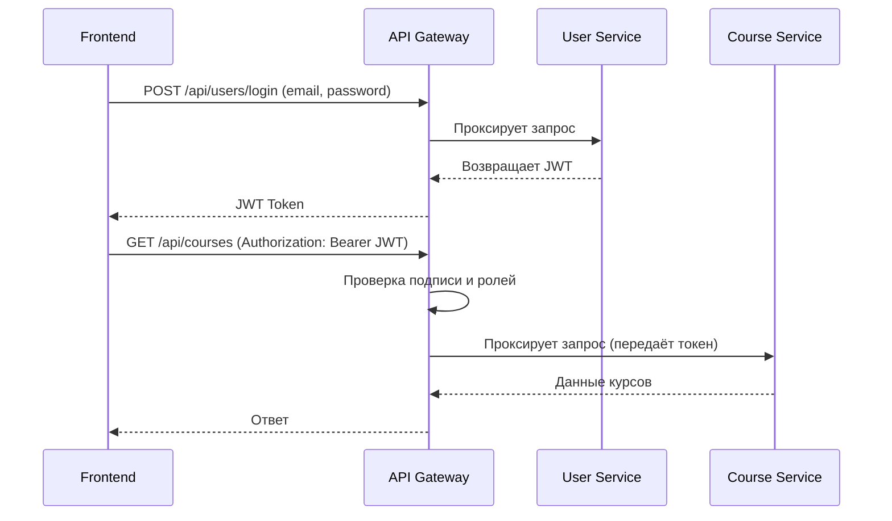

# 📘 Архитектура платформы онлайн-обучения

## 🏗️ Общий обзор

Система построена на микросервисной архитектуре.  
Все внешние запросы проходят через **API Gateway**, который выполняет аутентификацию, авторизацию, маршрутизацию и техническую защиту (rate limiting, CORS, логирование).

Каждый микросервис отвечает только за свой бизнес-домен и взаимодействует с остальными через HTTP (REST) по внутренней сети.

---

## 🌐 Визуальная схема архитектуры

```mermaid
graph TD
    subgraph CLIENT
        A[Frontend (React / Vue / Angular)]
    end

    subgraph GATEWAY
        B[API Gateway<br/>Spring Cloud Gateway<br/>:8080]
    end

    subgraph SERVICES
        U[User Service<br/>:8081<br/>PostgreSQL (users_db)]
        C[Course Service<br/>:8082<br/>PostgreSQL (courses_db)]
        E[Enrollment Service<br/>:8083<br/>PostgreSQL (enrollments_db)]
        P[Payment Service<br/>:8084<br/>PostgreSQL (payments_db)]
        N[Notification Service<br/>:8085<br/>PostgreSQL (notifications_db)]
        A2[Analytics Service<br/>:8086<br/>PostgreSQL (analytics_db)]
    end

    A -->|"HTTP + JWT Token"| B
    B -->|"Маршрутизация + валидация токена"| U
    B --> C
    B --> E
    B --> P
    B --> N
    B --> A2

    U -->|"Регистрация / Логин / JWT выдача"| B
```

---

## 🚪 API Gateway (порт 8080)

**Технология:** Spring Cloud Gateway  
**Роль:** единая точка входа для всех внешних запросов.

### 🔧 Основные функции
- ✅ **Аутентификация** — проверка JWT: подпись, `exp`, `iss`, `aud`.
- ✅ **Авторизация (coarse-grained)** — фильтрация маршрутов по ролям.
- ⚙️ **Rate Limiting** — ограничение частоты запросов.
- 🌍 **CORS** — разрешение доступа с фронтенда.
- 🧾 **Логирование и трассировка** (`X-Request-Id`, `Trace-Id`).
- 🔒 **Стриппинг заголовков** — удаление пользовательских `X-User-*`, добавление собственных.
- 🚫 **Блокировка прямого доступа** к микросервисам (доступ только из внутренней сети).

### 🔐 JWT-поток

1. Клиент выполняет `POST /api/users/login` (через Gateway).
2. Gateway маршрутизирует запрос в `User Service`.
3. `User Service` проверяет логин/пароль и **выдаёт JWT**.
4. Все последующие запросы клиент делает с `Authorization: Bearer <JWT>`.
5. Gateway проверяет JWT и пропускает запрос дальше в нужный сервис.

---

## 👤 User Service (порт 8081)

**Ответственность:**  
Регистрация, аутентификация, управление пользователями и ролями, выпуск JWT.

**База данных:** PostgreSQL (`users_db`)

### Основные компоненты:
- `UserService` — CRUD операции, профили, роли.
- `AuthService` — логин, refresh, logout, выдача токенов.
- `JwtProvider` — подпись и валидация JWT, хранение ключей.
- `RoleService` — управление ролями и правами (RBAC).

### Эндпоинты:
| Метод | Endpoint | Описание |
|--------|-----------|-----------|
| POST | `/api/users/register` | Регистрация нового пользователя |
| POST | `/api/users/login` | Аутентификация и выдача JWT |
| POST | `/api/users/refresh` | Обновление токена |
| GET | `/api/users/profile` | Просмотр профиля |
| PUT | `/api/users/profile` | Обновление профиля |
| GET | `/api/users/{id}` | Получение информации о пользователе |

---

## 🎓 Course Service (порт 8082)

**Ответственность:**  
Управление курсами, уроками и категориями.

**База данных:** PostgreSQL (`courses_db`)

**Эндпоинты:**
- `GET /api/courses` — список курсов (публично)
- `POST /api/courses` — создание курса (`teacher` или `admin`)
- `GET /api/courses/{id}` — информация о курсе
- `PUT /api/courses/{id}` — обновление курса
- `DELETE /api/courses/{id}` — удаление курса
- `GET /api/courses/{id}/lessons` — список уроков

---

## 🧾 Enrollment Service (порт 8083)

**Ответственность:**  
Запись студентов на курсы, прогресс и статистика обучения.

**База данных:** PostgreSQL (`enrollments_db`)

**Эндпоинты:**
- `POST /api/enrollments` — записать студента
- `GET /api/enrollments/user/{userId}` — все записи пользователя
- `GET /api/enrollments/course/{courseId}` — все студенты курса
- `PUT /api/enrollments/{id}/progress` — обновить прогресс

---

## 💳 Payment Service (порт 8084)

**Ответственность:**  
Платежи, история транзакций, возвраты.

**База данных:** PostgreSQL (`payments_db`)

**Эндпоинты:**
- `POST /api/payments/process`
- `GET /api/payments/user/{userId}`
- `GET /api/payments/{id}`
- `POST /api/payments/refund`

---

## 🔔 Notification Service (порт 8085)

**Ответственность:**  
Отправка email, push и SMS уведомлений.

**База данных:** PostgreSQL (`notifications_db`)

**Эндпоинты:**
- `POST /api/notifications/send`
- `GET /api/notifications/user/{userId}`
- `PUT /api/notifications/{id}/read`

---

## 📊 Analytics Service (порт 8086)

**Ответственность:**  
Сбор аналитики и статистики по пользователям, курсам, выручке и активности.

**База данных:** PostgreSQL (`analytics_db`)

**Эндпоинты:**
- `GET /api/analytics/users/stats`
- `GET /api/analytics/courses/stats`
- `GET /api/analytics/revenue`
- `GET /api/analytics/dashboard`

---

## 🔄 Поток аутентификации и запросов



---

## 🧠 Принципы безопасности

- Все сервисы доступны **только через API Gateway**.  
- Gateway проверяет JWT, сервисы — только права на конкретные ресурсы.  
- mTLS или внутренняя сеть для сервисов.  
- Короткоживущие JWT (5–15 мин) + refresh-токены.  
- Секреты и ключи JWT — только в `user-service`.  
- Все `X-User-*` заголовки обнуляются на входе в Gateway.  
- Rate limiting для `/login`, `/refresh`, `/payments/process`.  

---

## 🧩 Итоговая структура сервисов

| Сервис | Порт | Назначение |
|--------|------|------------|
| **API Gateway** | 8080 | Маршрутизация, JWT проверка, rate limiting |
| **User Service** | 8081 | Регистрация, логин, профили, токены |
| **Course Service** | 8082 | Курсы и уроки |
| **Enrollment Service** | 8083 | Записи и прогресс |
| **Payment Service** | 8084 | Платежи и транзакции |
| **Notification Service** | 8085 | Уведомления |
| **Analytics Service** | 8086 | Отчёты и статистика |
