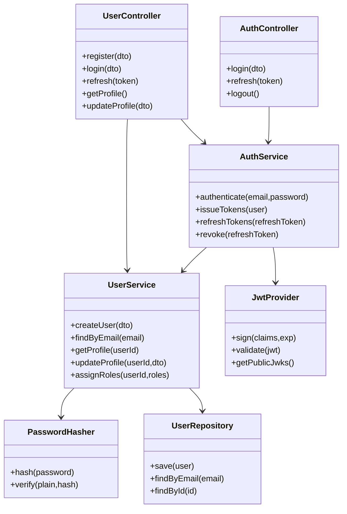
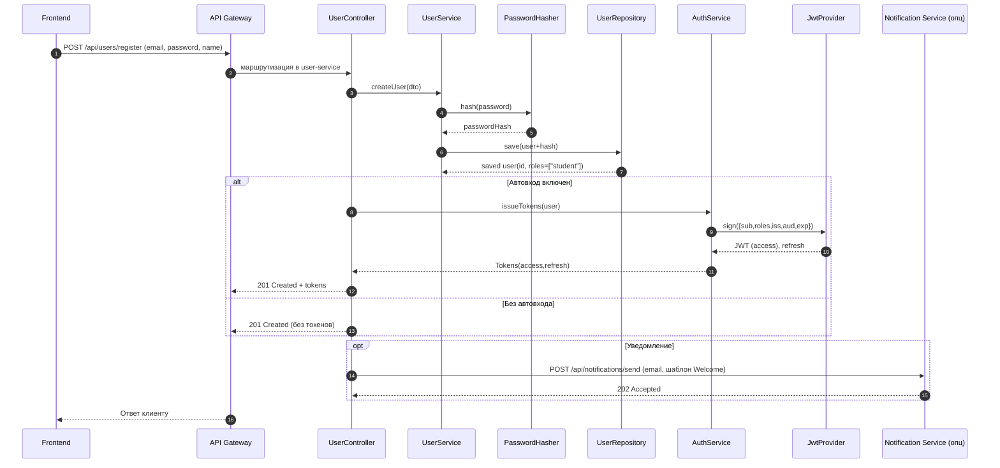
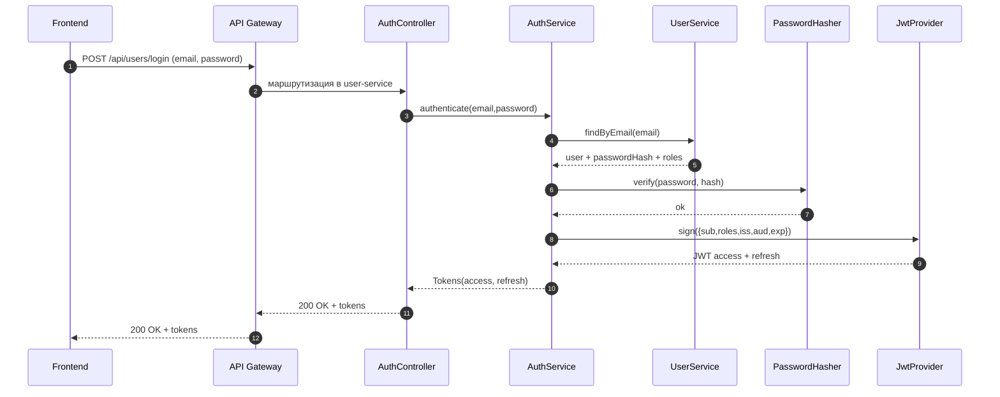
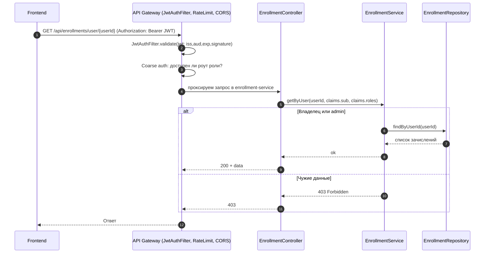
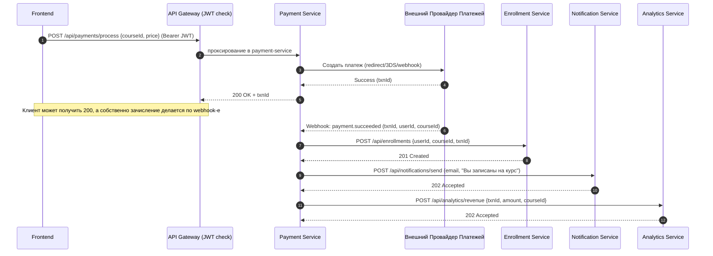

# 🔄 Жизненные сценарии и взаимодействие модулей (с API Gateway)

Ниже — наглядные **диаграммы последовательностей (Mermaid)** и **поэтапные описания**, показывающие, как модули и классы взаимодействуют в типичных сценариях: **регистрация**, **логин**, **доступ к защищённому ресурсу**, **запись на курс с оплатой**. Внутри каждого сценария разобрана **внутренняя работа классов** (контроллеры → сервисы → репозитории/утилиты).

> Легенда классов (по слоям в микросервисах):  
> **Controller** — принимает HTTP, валидирует вход;  
> **Service** — бизнес-логика;  
> **Repository** — доступ к БД;  
> **Utils** — хелперы (JwtProvider, PasswordHasher и т. п.).

---

## 0) Классическая структура классов (пример: User Service)

---

## 1) Регистрация пользователя (возможен «автовход» после регистрации)

**Что происходит внутри:**
1. `UserController.register` валидирует DTO, вызывает `UserService.createUser`.
2. `UserService` хеширует пароль через `PasswordHasher` (Argon2/bcrypt), сохраняет через `UserRepository`, по умолчанию даёт роль `student`.
3. Если включён «автовход», `AuthService.issueTokens` создаёт `access` и `refresh` через `JwtProvider`.
4. (Опционально) отправляется welcome‑уведомление в Notification Service.

---

## 2) Логин (аутентификация) и выдача токенов

**Внутри:**
- `AuthService.authenticate` тянет пользователя, сверяет пароль (`PasswordHasher.verify`), при успехе выпускает токены (`JwtProvider.sign`).  
- `API Gateway` здесь **не выдаёт токены**, он лишь проксирует. Выдача — строго в `user-service`.

---

## 3) Доступ к защищённому ресурсу (пример: свой список зачислений)

**Внутри:**
- **Gateway** проверяет JWT и «грубо» фильтрует доступ по ролям.  
- **EnrollmentService** делает «тонкую» проверку: `claims.sub == {userId}` или роль `admin`, иначе 403.

---

## 4) Запись на курс c оплатой и уведомлением

**Внутри Payment Service:**
- Контроллер принимает запрос и инициирует платёж у PSP (создание сессии/инвойса).
- На webhook `payment.succeeded` проверяется подпись вебхука, извлекаются `userId/courseId`, создаётся запись в Enrollment Service, шлётся письмо и метрика в Analytics.

---

## 5) Как работает API Gateway — технически

- **JwtAuthFilter** (или Spring Security) вешается на защищённые маршруты:
  - Проверяет подпись/`exp`/`iss`/`aud` (`/.well-known/jwks.json` в user-service).
  - Делает **coarse-grained** проверку ролей по маршруту/методу.
  - Ставит `X-Request-Id`, чистит входящие `X-User-*`, добавляет служебные заголовки.
- **Проксирование**: исходный `Authorization: Bearer <JWT>` либо:
  - прокидывается дальше в сервис (**Вариант A**), и сервисы имеют общий middleware для тонких проверок,  
  - или заменяется на подписанные внутренние заголовки `X-Auth-*` (**Вариант B**) с HMAC-подписью и TTL.
- **Технические фильтры**: Rate limiting (`/login`/`/refresh`/платежи), CORS, логирование, WAF.

---

## 6) Мини-чеклист на каждый сценарий

- Gateway: проверка JWT + грубая авторизация по роутам.
- Сервис: тонкая авторизация по **конкретным данным** (владелец/роль).
- Все сервисы — только из внутренней сети, **mTLS** между gateway и сервисами.
- Короткие access‑токены (5–15 мин), refresh — через user‑service.
- Логи/трейсы по `X-Request-Id`, корреляция событий (в т.ч. webhooks).
